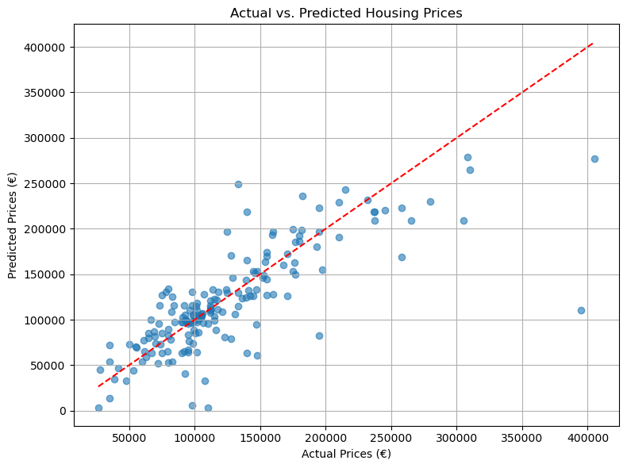
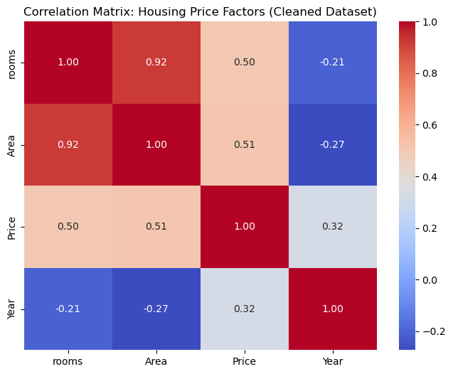
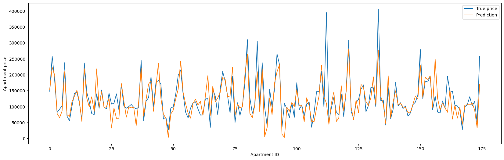
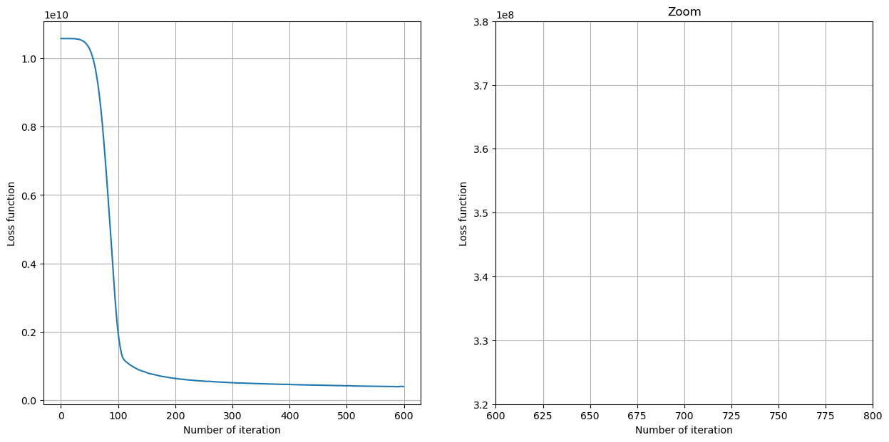

# House-Pricing-Prediction 
## Predicting Oulu housing prices using Python regression models

---

## 📊 Project Overview

**Objective:**  
Predict housing prices based on a provided, pre-cleaned real-world dataset from the Oulu housing market. This project focuses on applying exploratory data analysis (EDA), feature engineering, and developing regression models to achieve accurate price predictions.

---

## Tools & Techniques

- Python (Pandas, NumPy, Scikit-learn)
- Jupyter Notebook
- Data visualization (Matplotlib, Seaborn)
- Regression models (Linear Regression, Random Forest, etc.)

---

## Key Steps

- Performed exploratory data analysis (EDA) to understand variable relationships  
- Engineered features to improve model performance  
- Built and tested multiple regression models  
- Evaluated model accuracy using R² score, RMSE  
- Visualized results to highlight insights

---

## Key Insights from Model
*Model Performance:*
Achieved R² = 0.81 on training data and R² = 0.61 on test data, showing the model explains 61% of price variance on unseen data — a solid performance, with room for improvement through regularization or additional features.

*Feature Impact:*
Area, year of construction, and number of rooms were the strongest predictors. Apartments with elevators or in good condition showed measurable price premiums.

*Market Trend Insight:*
Small apartments (under 40 m²) tend to have a higher price per square meter, reflecting strong demand in compact urban zones.

*Visual Takeaways:*
The correlation heatmap highlighted a strong relationship between area and rooms (r = 0.92), while actual vs. predicted plots confirmed the model’s solid mid-range performance but revealed some spread at higher price levels.

---

## 📁 Project Files

- `real_estate_model.ipynb` → Main Jupyter notebook with full analysis and modeling steps  
- `oulu_apartment_data_for_analysis/` → Folder for dataset files 
- `plots/` → Key visualizations and output charts

## Actual vs. Predicted Housing Prices

Shows how well predicted prices align with actual market prices. While most predictions align closely with actual prices, the scatter shows a widening spread at higher price ranges. This suggests the model handles mid-range properties well but may struggle with luxury or outlier-priced apartments. Future work could focus on improving predictions for the high-end segment, perhaps by using specialized models or adding more detailed features (like luxury amenities or specific location factors).

## Correlation Matrix Heatmap

Highlights key correlations between variables, e.g., area and rooms, price and year. The strong correlation between area and rooms is expected and validates the dataset. However, moderate correlations with price suggest there’s no single dominant predictor — indicating a need for multi-feature modeling.

## True vs. Predicted Prices Over Apartments

Line plot comparing true vs. predicted prices across individual apartments. The parallel movement of true and predicted prices shows the model is capturing the overall trend well.

## Training Loss Curve

Displays model convergence over iterations; zoomed section highlights stabilization. The loss curve shows steady convergence, which is positive. The zoomed-in section reveals a plateau, meaning the model is no longer learning significantly after a point. This suggests the current training setup is well-tuned, but it might be worth experimenting with early stopping or learning rate adjustments to prevent overtraining. 

---

## Outcome

Successfully developed a machine learning pipeline for predicting housing prices, strengthening skills in data preprocessing, regression modeling, and business-relevant insights.

